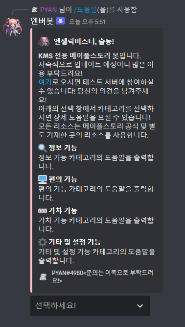
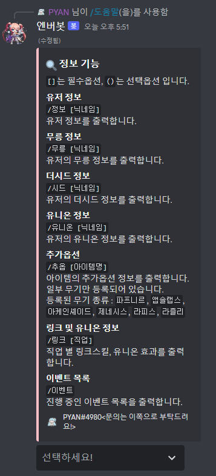
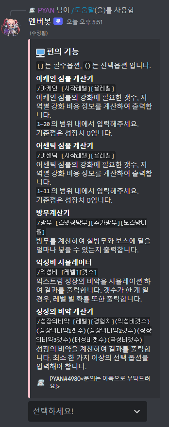
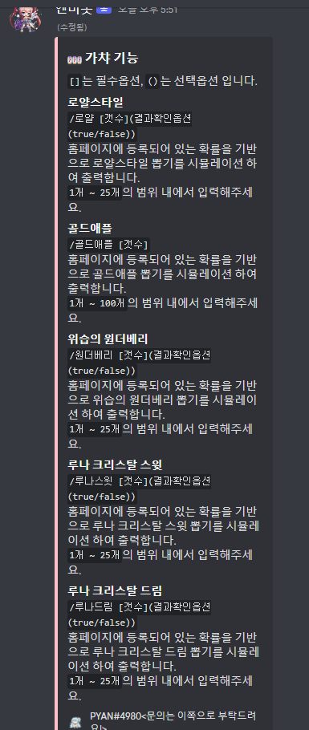
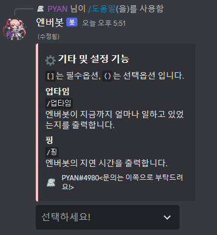

Hello, This is PYAN#4980.

I'm sorry for the late reply.

I hope this answer will help my bot's verification process.

First question,
```
1) Can you provide some links to screenshots and videos of your bot in operation within a Discord server? Your application and bot listings are rather vague and we'd like to know more about what your bot actually does.
 
It might be through YouTube, Imgur, or another platform. As we are unable to download any files supplied to us, this would be extremely helpful to us in our inquiry. I appreciate your understanding of the situation.
```

Here is some Video(gif Files) for answer.


You can also check it on below link.

https://github.com/ikellllllll/AngelicBusterBotDocuments/tree/main/forVerification/Movie(GIF)

Second question,
```
2) The help/command list for your Bot, so we can confirm how your bot is used.
```

Here is list of commands(help list).



This is Help Command's Main Embed.



This is Help command's Information category embed.(It contains User information, user game history, skill information, game equipment information, event list, etc.)



This is Help command's Convenience category embed.(It contains simulator, Calculator etc.)



This is Help command's Gacha category embed.(It contains Clothes gacha, pet gacha, etc.)



This is Help command's Others category embed.(It contains uptime, and ping.)

Third question,
```
3) Can you also please share your share code snippets from your most used commands?
```

I share for you code that works for user information.

```
// ReadyListener.java

if (e.getName().equals("정보")) {
  e.deferReply().queue();
	OptionMapping option = e.getOption("닉네임");

	if (option == null) {
		e.getHook().sendMessageEmbeds(mapleUserTypingFail()).queue();
		return;
	}

	String nickName = option.getAsString();
	e.getHook().sendMessageEmbeds(mapleUserInfo(nickName)).queue();
	System.out.println("Success\n"); // By logging
	
	return;
}

...

MessageEmbed mapleUserInfo(String nickName) {
	String nick = nickName.trim();
	if (nick.equals("")) {
		return mapleUserTypingFail();
	}

  MapleGGCrawling mc = new MapleGGCrawling(nick);

	String imageUrl = mc.crawCharacterImage();
	if (imageUrl.equals("user_not_exist")) {
		return mapleUserInfoError(mc.getUrl());
	}

	String[] basicInfoArr = mc.crawCharacterBasicInfo();

	EmbedBuilder eb = new EmbedBuilder();

	eb.setAuthor(basicInfoArr[6], mc.getUrl(), imageUrl);
	eb.setColor(new Color(255, 192, 203));
	eb.setThumbnail(basicInfoArr[0]);
	eb.addField("레벨", basicInfoArr[1], false);
	eb.addField("직업", basicInfoArr[2], false);
	eb.addField("인기도", basicInfoArr[3], false);
	eb.addField("길드", basicInfoArr[4], false);
	eb.setFooter(basicInfoArr[5] + " | maple.gg");

	return eb.build();
}

// MapleGGCrawling.java

public MapleGGCrawling(String name) {
	this.name = name;
	urlEdit();

	conn = Jsoup.connect(url);
	if (!isUrlValid()) {
		return;
	}
}

...

public String[] crawCharacterBasicInfo() {
	String worldImageUrl;
	String level;
	String job;
	String popular;
	String guild;
	String updated;
	String userName;
	String[] arr = null;

	try {
		Document document = conn.get();
		Elements worldElement = document.getElementsByClass("align-middle");
		worldImageUrl = worldElement.attr("abs:src");
		userName = worldElement.get(1).text();
			
		Elements userSummaryElement = document.getElementsByClass("user-summary-item");

		level = userSummaryElement.get(0).text();
		job = userSummaryElement.get(1).text();
		popular = userSummaryElement.get(2).text().replace("인기도 ", "");

		Elements guildElement = document.getElementsByClass("col-lg-2 col-md-4 col-sm-4 col-12 mt-3");

		guild = guildElement.get(0).text().replace("길드 ", "");
			
		Elements updateElement = document.getElementsByClass("d-block font-weight-light");
			
		updated = updateElement.get(0).text();

		arr = new String[] { worldImageUrl, level, job, popular, guild, updated, userName };

	} catch (IOException e) {
		e.printStackTrace();
	}

	return arr;
}
```

Thank you.
